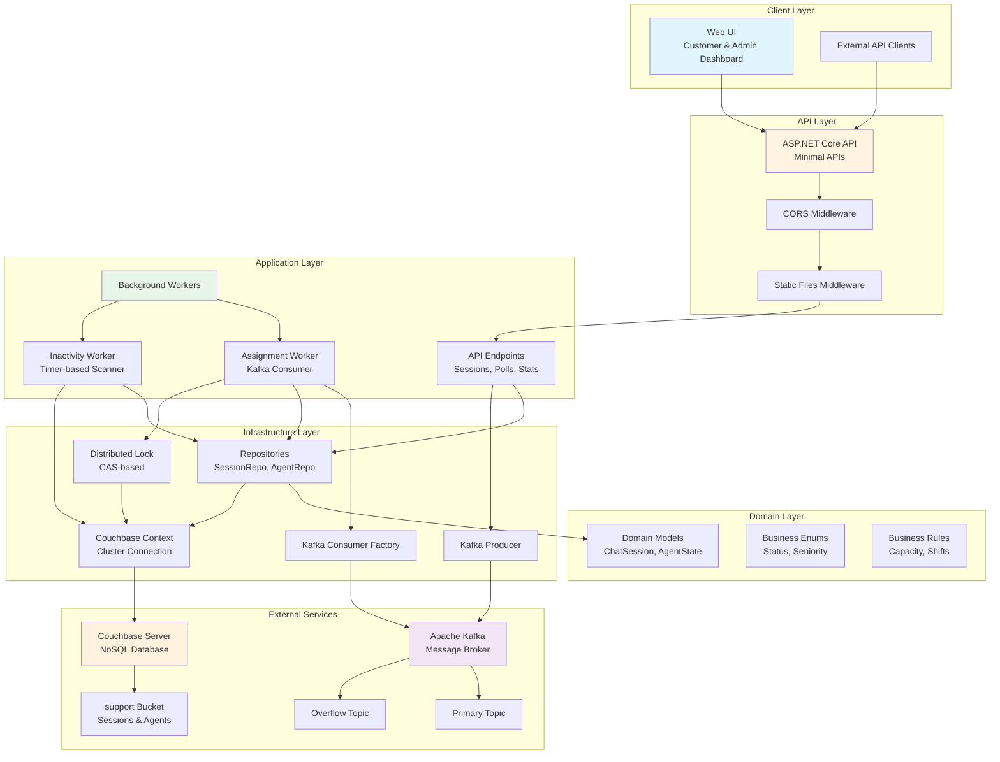
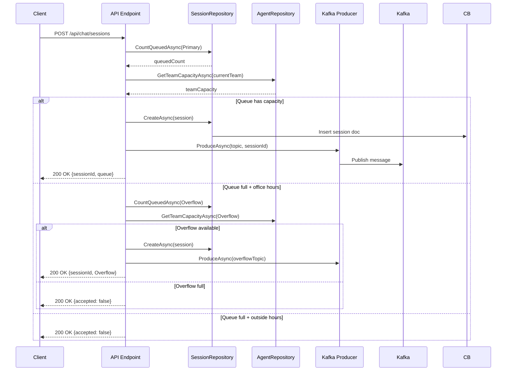
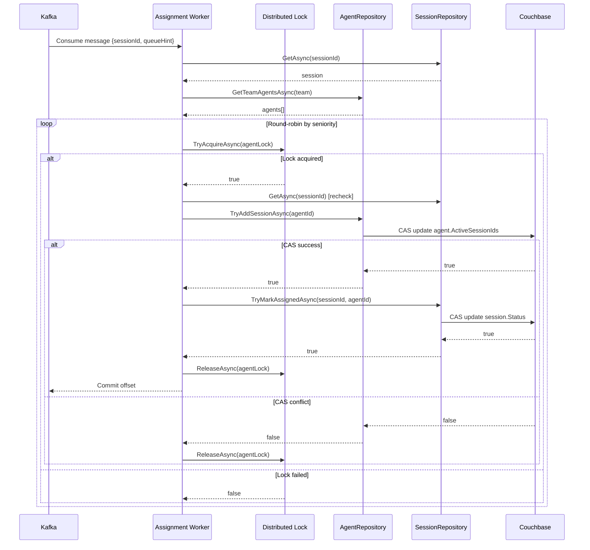
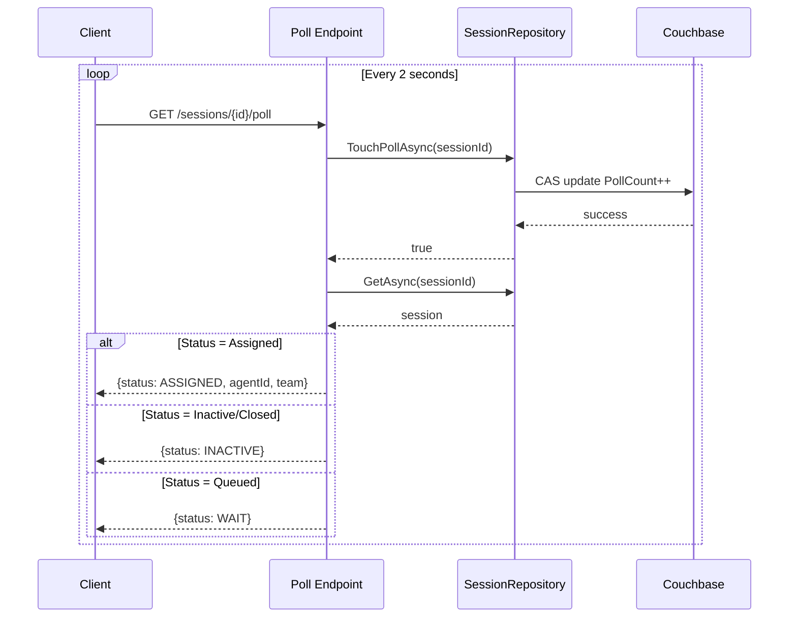
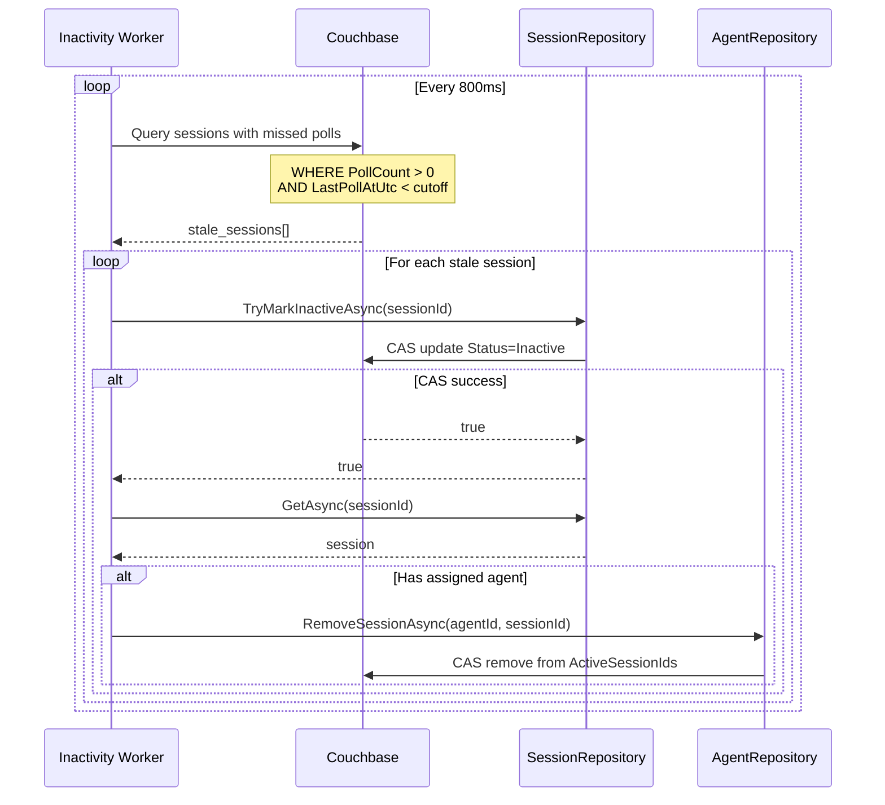
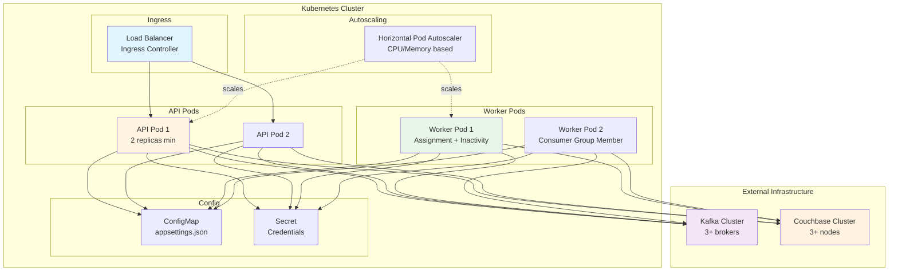

# Architecture Diagram

## System Overview

## Component Details

### Client Layer
- **Web UI**: Modern JavaScript SPA with customer chat interface and admin dashboard
- **External Clients**: REST API consumers (mobile apps, integrations)

### API Layer
- **ASP.NET Core 8**: Minimal APIs for lightweight, high-performance endpoints
- **CORS**: Cross-Origin Resource Sharing for browser-based clients
- **Static Files**: Serves wwwroot content (HTML, CSS, JS)

### Application Layer
- **API Endpoints**: 
  - `POST /api/chat/sessions` - Create session with queue validation
  - `GET /api/chat/sessions/{id}` - Get session details
  - `GET /api/chat/sessions/{id}/poll` - Poll for assignment
  - `GET /api/chat/sessions` - List sessions (admin)
  - `GET /api/chat/agents` - List agents (admin)
  - `GET /api/chat/stats` - System statistics (admin)

- **Background Workers**:
  - **Assignment Worker**: Consumes from Kafka topics, assigns sessions to agents using round-robin with seniority priority
  - **Inactivity Worker**: Scans for sessions missing 3 polls, marks inactive and releases agent slots

### Domain Layer
- **Models**: `ChatSession`, `AgentState` with business logic
- **Enums**: `ChatSessionStatus`, `Seniority` for type safety
- **Business Rules**: Capacity calculations, shift validation, office hours

### Infrastructure Layer
- **Repositories**: Data access abstraction with CAS-based optimistic locking
- **Distributed Lock**: Agent-level locking during assignment to prevent race conditions
- **Kafka Integration**: Producer for queueing, consumer factory for workers
- **Couchbase Context**: Singleton cluster connection with collection access

### External Services
- **Apache Kafka**: Message broker for reliable FIFO queue processing
  - **Primary Topic**: Default queue for sessions
  - **Overflow Topic**: Office hours overflow when primary is full
  
- **Couchbase Server**: NoSQL database for session and agent state
  - **support Bucket**: Default collection stores all documents
  - **Document Types**: `session::<guid>`, `agent::<id>`, `lock::<key>`

## Data Flow

### Session Creation Flow

### Assignment Flow

### Polling Flow

### Inactivity Detection Flow

## Technology Stack

| Layer | Technology | Purpose |
|-------|-----------|---------|
| Runtime | .NET 8.0 | Modern, high-performance framework |
| API | ASP.NET Core Minimal APIs | Lightweight HTTP endpoints |
| Message Broker | Apache Kafka 7.5.0 | Reliable FIFO queue with partitioning |
| Database | Couchbase (latest) | NoSQL with N1QL queries and CAS |
| UI | Vanilla JavaScript + CSS | No framework dependencies |
| Containerization | Docker + Docker Compose | Local development environment |
| Orchestration | Kubernetes | Production deployment (optional) |

## Scalability Considerations

### Horizontal Scaling
- **Multiple API Instances**: Stateless endpoints with load balancer
- **Kafka Partitioning**: Partition by session ID for parallel processing
- **Kafka Consumer Groups**: Multiple worker instances share partition load
- **Couchbase Cluster**: Distributed nodes with replication

### Concurrency Control
- **CAS Operations**: Optimistic locking on all state mutations
- **Distributed Locks**: Agent-level locks during assignment
- **Idempotent Operations**: Safe retry on conflicts

### Performance Optimizations
- **In-Memory Round-Robin**: Per-worker cursors (consistency not critical)
- **Batch Operations**: Kafka commit after successful assignment
- **Query Indexes**: N1QL indexes on Status, Team, LastPollAtUtc
- **Connection Pooling**: Singleton Couchbase cluster connection

## Deployment Architecture

## Security Considerations

- **CORS**: Configured for browser-based access
- **Secrets Management**: Kubernetes Secrets for credentials
- **Network Policies**: Restrict pod-to-pod communication
- **TLS/SSL**: HTTPS for external traffic (Ingress)
- **Authentication**: Not implemented (add OAuth2/JWT as needed)
- **Rate Limiting**: Not implemented (add API gateway as needed)
