# Workflow Diagrams

## Complete Chat Session Lifecycle

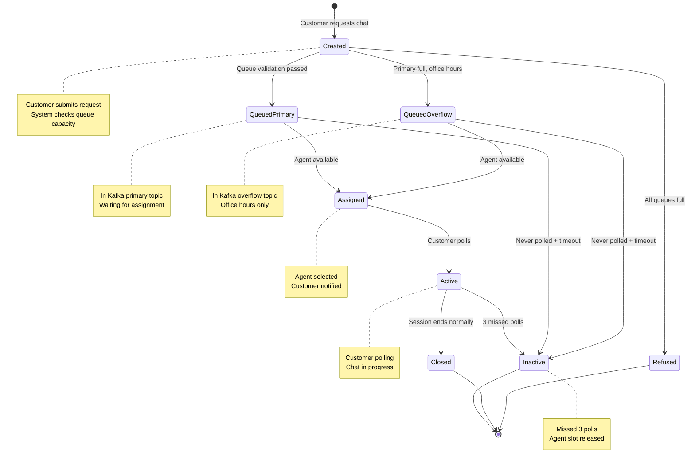

## Session Creation & Queue Validation Workflow

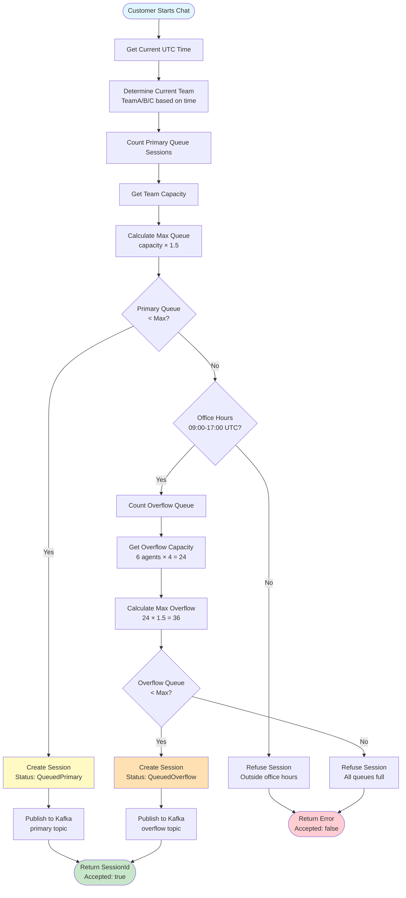

## Agent Assignment Workflow

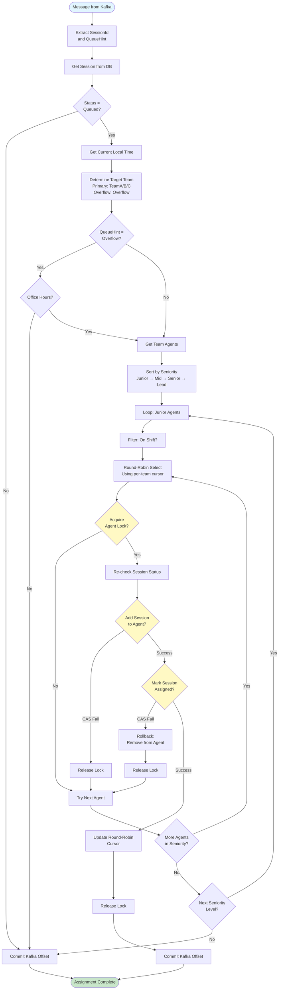

## Customer Polling Workflow

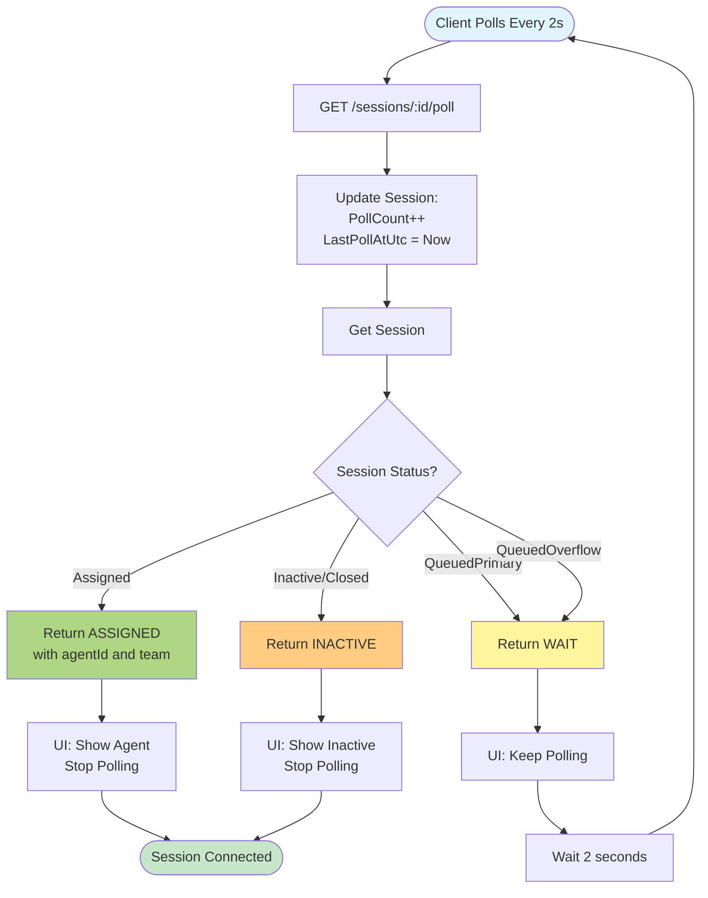

## Inactivity Detection Workflow

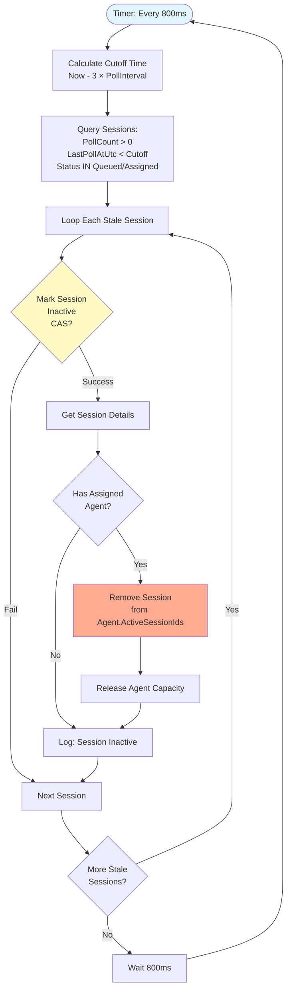

## Team Selection Logic

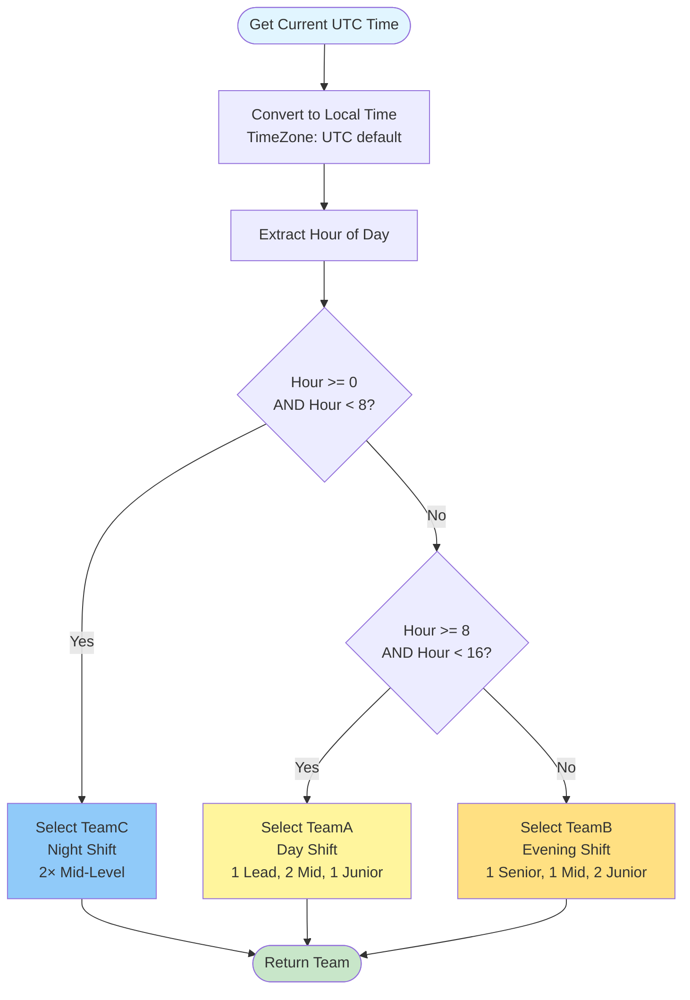

## Round-Robin Agent Selection

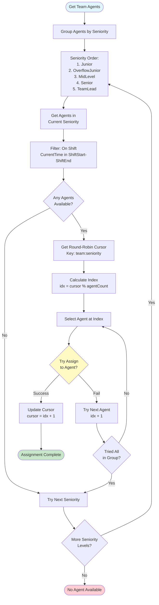

## Capacity Calculation

```mermaid
flowchart TD
    Start([Calculate Team Capacity]) --> GetAgents[Get All Agents in Team]
    GetAgents --> LoopAgents[For Each Agent]
    
    LoopAgents --> GetSeniority{Agent Seniority?}
    
    GetSeniority -->|Junior| MultJunior[10 × 0.4 = 4]
    GetSeniority -->|MidLevel| MultMid[10 × 0.6 = 6]
    GetSeniority -->|Senior| MultSenior[10 × 0.8 = 8]
    GetSeniority -->|TeamLead| MultLead[10 × 0.5 = 5]
    GetSeniority -->|OverflowJunior| MultOverflow[10 × 0.4 = 4]
    
    MultJunior --> AddToTotal[Add to Total Capacity]
    MultMid --> AddToTotal
    MultSenior --> AddToTotal
    MultLead --> AddToTotal
    MultOverflow --> AddToTotal
    
    AddToTotal --> MoreAgents{More Agents?}
    MoreAgents -->|Yes| LoopAgents
    MoreAgents -->|No| CalcQueue[Calculate Max Queue<br/>capacity × 1.5<br/>Round Down]
    
    CalcQueue --> Return([Return Capacity & MaxQueue])
    
    style Start fill:#e1f5ff
    style Return fill:#c8e6c9
    
    note right of GetSeniority
        MaxConcurrentChats = 10
        Multiplier varies by seniority
        Floor result to integer
    end note
```

## Example Scenarios

### Scenario 1: Normal Assignment (Office Hours)
```mermaid
gantt
    title Chat Session Timeline - Successful Assignment
    dateFormat HH:mm:ss
    axisFormat %H:%M:%S
    
    section Customer
    Submit Request     :active, 10:00:00, 1s
    Start Polling      :active, 10:00:01, 5s
    Receive Assignment :milestone, 10:00:05, 0s
    
    section System
    Queue Validation   :10:00:00, 1s
    Publish to Kafka   :10:00:01, 1s
    
    section Worker
    Consume Message    :10:00:02, 1s
    Find Agent         :10:00:03, 1s
    Acquire Lock       :10:00:04, 500ms
    Assign Session     :10:00:04, 1s
    
    section Agent
    Update ActiveSessions :10:00:04, 500ms
    Ready for Chat        :milestone, 10:00:05, 0s
```

### Scenario 2: Overflow Routing (Queue Full)
```mermaid
gantt
    title Chat Session Timeline - Overflow Routing
    dateFormat HH:mm:ss
    axisFormat %H:%M:%S
    
    section Customer
    Submit Request     :active, 14:30:00, 1s
    
    section System
    Check Primary Queue   :14:30:00, 500ms
    Primary Queue Full    :crit, 14:30:00, 100ms
    Check Office Hours    :14:30:00, 100ms
    Check Overflow Queue  :14:30:01, 500ms
    Overflow Available    :14:30:01, 100ms
    Route to Overflow     :14:30:01, 500ms
    Publish to Kafka      :14:30:02, 1s
    
    section Worker
    Consume from Overflow :14:30:03, 1s
    Assign to Overflow Agent :14:30:04, 2s
    
    section Customer
    Receive Assignment :milestone, 14:30:06, 0s
```

### Scenario 3: Session Refusal (All Queues Full)
```mermaid
gantt
    title Chat Session Timeline - Refused
    dateFormat HH:mm:ss
    axisFormat %H:%M:%S
    
    section Customer
    Submit Request        :active, 15:45:00, 1s
    Receive Refusal       :crit, 15:45:01, 0s
    
    section System
    Check Primary Queue      :15:45:00, 300ms
    Primary Queue Full       :crit, 15:45:00, 100ms
    Check Office Hours       :15:45:00, 100ms
    Check Overflow Queue     :15:45:01, 300ms
    Overflow Queue Full      :crit, 15:45:01, 100ms
    Return Refusal Response  :crit, 15:45:01, 200ms
```

### Scenario 4: Inactivity Detection
```mermaid
gantt
    title Chat Session Timeline - Inactive
    dateFormat HH:mm:ss
    axisFormat %H:%M:%S
    
    section Customer
    Last Poll          :active, 11:00:00, 1s
    Stop Polling       :crit, 11:00:01, 6s
    
    section System
    Poll Count = 5     :11:00:01, 0s
    No Poll Received   :crit, 11:00:01, 3s
    No Poll Received   :crit, 11:00:04, 3s
    
    section Worker
    Scan for Inactive  :11:00:04, 800ms
    Detect Stale Session :crit, 11:00:05, 100ms
    Mark Inactive      :11:00:05, 500ms
    Release Agent Slot :11:00:05, 500ms
```
